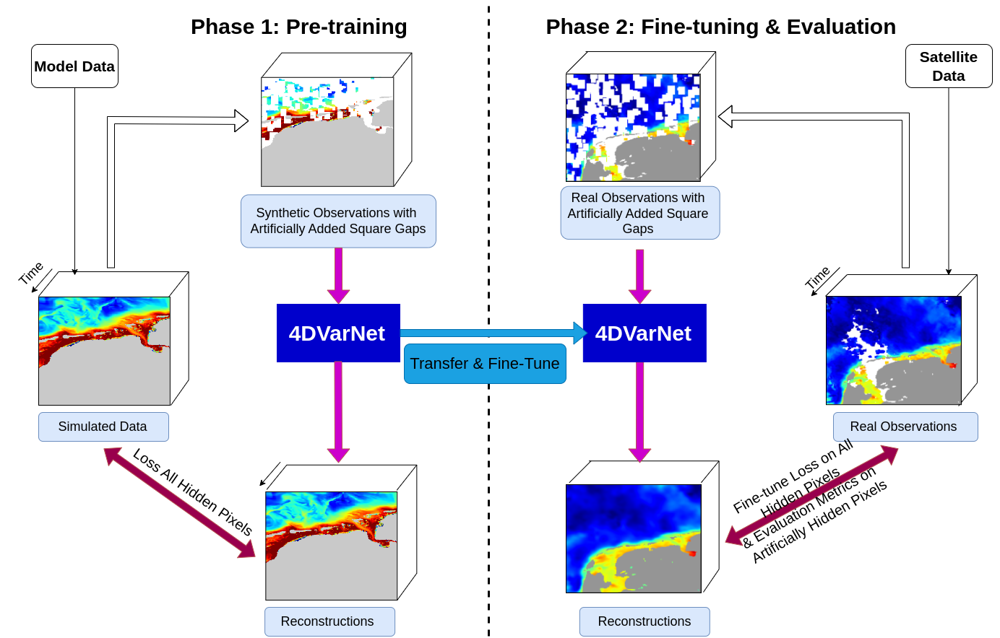
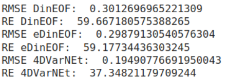
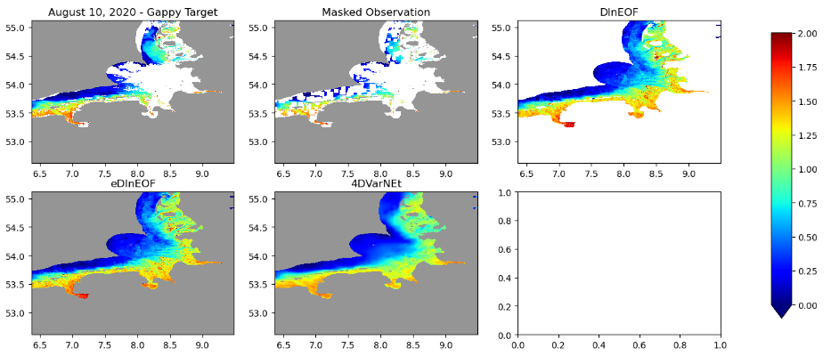

# How to use the 4DVarNet scheme for turbidity mapping

---
## Abstract

The purpose of the  4DVarNet scheme for turbidity mapping is to reconstruct and map gappy, noisy satellite observations to obtain gap-free, less noisy reconstructions using a pretrained 4DVarNet model, as shown in the image below:

Papers and references to understand the 4DVarNet scheme can be found at [https://drive.google.com/drive/folders/1O2MLvO-UpKn7cAIBaDHLYhT81NlE1py-?usp=sharing](https://drive.google.com/drive/folders/1O2MLvO-UpKn7cAIBaDHLYhT81NlE1py-?usp=sharing)

The main 4Dvarnet project can be found at [https://github.com/CIA-Oceanix/4dvarnet-starter](https://github.com/CIA-Oceanix/4dvarnet-starter)

The code of the 4DVarNet scheme for turbidity mapping can be found at [https://github.com/nguyenthuynga/4dvarnet-starter](https://github.com/nguyenthuynga/4dvarnet-starter)

---
## Tutorial

A tutorial focuses on applying the 4DVarNet for sea surface turbidity mapping in the Wadden Sea.

You will learn how to run the inference phase using a pre-trained 4DVarNet model and then compare the results with other existing state-of-the-art turbidity mappings.

The Jupyter notebook, turbidity_output_analysis.ipynb, explains the purpose of each cell at the beginning. 

It runs 4DVArNet Predictions to Perform Machine Learning-Based Interpolation on Gappy Satellite Observations with 4DVarNet.

And returns a comparison of different mapping schemes: 4DVarNet, DInEOF, and eDInEOF.

This tutorial use data which are already preprocessing (by taking log10 values), to quick run the code without changing too many things. 

Theses datas are downloaded from "Wasabi Storage" within the notebook, and are also available in this Drive folder : [https://drive.google.com/drive/folders/1JwX9sn6gm2-RgEJ10Pxw5dh_S8h-dyaV?usp=sharing](https://drive.google.com/drive/folders/1JwX9sn6gm2-RgEJ10Pxw5dh_S8h-dyaV?usp=sharing).

To get more informations about tutorial configuration and dataset, or if you want to use other dataset, or other parameters, follow the [Use custom dataset](./custom-dataset.md) documentation.

---
## Tutorial Technical environment

This tutorial use an environment with Pytorch lightning, and Hydra.

The easyest way of running this tutorial, it to use the EDITO Datalab Platform :

1. Go to the [Ocean Modelling catalog](https://datalab.dive.edito.eu/catalog/ocean-modelling)
2. Search and launch the **turbiditymapping-4dvarNet** service.

But the environment can also be installed your laptop or serveur, following the [Install environment](./manual-installation.md) documentation.

If you are using Docker or Singularity/Apptainer, you can use the `inseefrlab/onyxia-jupyter-pytorch:py3.11.10-gpu` image.

---
## How to use the tutorial

1. Run Jupyter Notebook **turbidity_output_analysis.ipynb** :
   - It first downloads the datas : the OSE CMEMS data + pretrained 4DVarNet weight
   - Then runs the main script, which generate output inside the outputs folder.
   - And  runs python code to get the analysis, visualisation of 4DVarNet compared with two other existing data driven algorithms (DInEOF and eDInEOF). 

2. After this steps, you’ll be able to get the metrics (RMSE-Root Mean Square Error and RE-Relative Error) and the visualisation. as below.

---
## Other informations

---
## Useful links

- [Hydra documentation](https://hydra.cc/docs/intro/)
- [Pytorch lightning documentation](https://pytorch-lightning.readthedocs.io/en/stable/index.
- [Papers and references to understand the 4DVarNet scheme](https://drive.google.com/drive/folders/1O2MLvO-UpKn7cAIBaDHLYhT81NlE1py-?usp=sharing)
- The work in progress code can found here [https://github.com/nguyenthuynga/4dvarnet-starter](https://github.com/nguyenthuynga/4dvarnet-starter)
- A general tutorial of 4DVarNet method programming can be found here [https://colab.research.google.com/drive/1oYBRbRWGBiy77m7KYm7t-EIzajSMf82N?usp=sharing](https://colab.research.google.com/drive/1oYBRbRWGBiy77m7KYm7t-EIzajSMf82N?usp=sharing). . This is made by Quentin, a member of Ronan’s team, You can use this tutorial to visualise after training your 4DVarNet model. **But be careful it is not for Sea Surface Turbidity, but for SSH!**
- A version of this (without hydra) can be found on google colab [https://colab.research.google.com/drive/1fAJiHylAVVylxo7M3G4flkv5x9jWLp0C?usp=sharing](https://colab.research.google.com/drive/1fAJiHylAVVylxo7M3G4flkv5x9jWLp0C?usp=sharing), but I recommend you to use github version [https://github.com/nguyenthuynga/4dvarnet-starter](https://github.com/nguyenthuynga/4dvarnet-starter) because it is modular and easier to run on HPC. 
html#get-started)
- 4DVarNet papers:
	- Fablet, R.; Amar, M. M.; Febvre, Q.; Beauchamp, M.; Chapron, B. END-TO-END PHYSICS-INFORMED REPRESENTATION LEARNING FOR SA℡LITE OCEAN REMOTE SENSING DATA: APPLICATIONS TO SA℡LITE ALTIMETRY AND SEA SURFACE CURRENTS. ISPRS Annals of the Photogrammetry, Remote Sensing and Spatial Information Sciences 2021, V-3–2021, 295–302. https://doi.org/10.5194/isprs-annals-v-3-2021-295-2021.
	- Fablet, R.; Chapron, B.; Drumetz, L.; Mmin, E.; Pannekoucke, O.; Rousseau, F. Learning Variational Data Assimilation Models and Solvers. Journal of Advances in Modeling Earth Systems n/a (n/a), e2021MS002572. https://doi.org/10.1029/2021MS002572.
	- Fablet, R.; Beauchamp, M.; Drumetz, L.; Rousseau, F. Joint Interpolation and Representation Learning for Irregularly Sampled Satellite-Derived Geophysical Fields. Frontiers in Applied Mathematics and Statistics 2021, 7. https://doi.org/10.3389/fams.2021.655224.

Copyright IMT Atlantique/OceaniX, contributor(s) : M. Beauchamp, R. Fablet, Q. Febvre, D. Zhu (IMT Atlantique) 

Contact person: ronan.fablet@imt-atlantique.fr.

This software is a computer program whose purpose is to apply deep learning schemes to dynamical systems and ocean remote sensing data. This software is governed by the CeCILL-C license under French law and abiding by the rules of distribution of free software. You can use, modify and/ or redistribute the software under the terms of the CeCILL-C license as circulated by CEA, CNRS and INRIA at the following URL "http://www.cecill.info". As a counterpart to the access to the source code and rights to copy, modify and redistribute granted by the license, users are provided only with a limited warranty and the software's author, the holder of the economic rights, and the successive licensors have only limited liability. In this respect, the user's attention is drawn to the risks associated with loading, using, modifying and/or developing or reproducing the software by the user in light of its specific status of free software, that may mean that it is complicated to manipulate, and that also therefore means that it is reserved for developers and experienced professionals having in-depth computer knowledge. Users are therefore encouraged to load and test the software's suitability as regards their requirements in conditions enabling the security of their systems and/or data to be ensured and, more generally, to use and operate it in the same conditions as regards security. The fact that you are presently reading this means that you have had knowledge of the CeCILL-C license and that you accept its terms.

