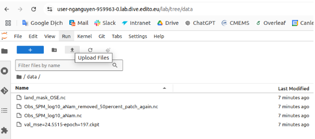

# Use custom DatasSet


---
## Data sources

The data used in this tutorial (Real Satellite images from CMEMS ) can be downloaded in CMEMS following these steps:

- Go to the CMEMS website [https://data.marine.copernicus.eu/product/OCEANCOLOUR_ATL_BGC_L3_MY_009_113/description](https://data.marine.copernicus.eu/product/OCEANCOLOUR_ATL_BGC_L3_MY_009_113/description)
- Then click on “Data Access” on the left side
- Choose “cmems_obs-oc_atl_bgc-transp_my_l3-multi-1km_P1D” with MOTU product.
- After that, fill the longitude and latitude range and download the data (Data range area used here are : lat = 52.5 to 55; lon =4.44 to 7.56)


Data and pretrained weight for the German Wadden Sea used in the tutorial can be downloaded at : [https://drive.google.com/drive/folders/1JwX9sn6gm2-RgEJ10Pxw5dh_S8h-dyaV?usp=sharing](https://drive.google.com/drive/folders/1JwX9sn6gm2-RgEJ10Pxw5dh_S8h-dyaV?usp=sharing)

Data+Code+pretrained weight for the Dutch Wadden Sea (from Fabio) can be downloaded at : [https://drive.google.com/drive/folders/1T5Z8qgl2c3ScyxJ50fgEbU9g6IzpOzxm?usp=sharing](https://drive.google.com/drive/folders/)


To run on different dataset, you might need:

- Change `load_bbp_data` in src/utils
- Change `rand_obs` in src/data, but it is optional

Feel free to contact us, if you need help to write the code to preprocess data.


---
## Step 0: Make sure that you download the data and upload in ./data subfolder

Upload the files using the button “Upload files” as figure below :




---
## Step 1:  Run 4DVArNet Predictions to Perform Machine Learning-Based Interpolation on Gappy Satellite Observations with 4DVarNet

You need to change the configuration in `4dvarnet-starter/config/xp/turbidity_output_analysis.yaml`, basically once you have your dataset (xarray) already, you need to change the paths to point to your dataset, and change the period of training, validation and test periods to fit your purpose.


Follow instructions in base_test.yaml: change the path to the data you want to test (the growth truth is the same as the observation path) and the path of the chosen weight (check point path).

Other parameters can be maintained the same as default (except if you get GPU memory problems, you can reduce batch size or reduce patch_dims.time etc).


1. Navigate to the project directory:
``` bash
cd 4dvarnet-turbiditymapping (please change the directory to yours)
``` 
2. Modify the directory of the pretrained weight in the last line of the configuration file .`config/xp/test_SCHISM_AugPatches_BiggerModel_smallerTimeWindows.yaml`:
```  bash
entrypoints:
  ... 
  - _target_: src.test.base_test
    ...
    ckpt_path: "data/checkpoints/val_mse=24.5515-epoch=197.ckpt"
```
3. Execute the main script:  
``` bash
CUDA_VISIBLE_DEVICES=n  python main.py xp=test_SCHISM_AugPatches_BiggerModel_smallerTimeWindows
```
Where `n` is the number of the available GPU, you can check which GPUs are available by:
```bash
nvidia-smi 
```

The result of this command, will contain the path to the outputs datas as below (the date/time will be depends on your execution time):
``` python
`outputs/2024-10-02/14-11-38/test_SCHISM_AugPatches_BiggerModel_smallerTimeWindows/TestonOSE_DutchWaddenSea/test_data.nc`
```
You will get an output file inside this folder.

---
## Step 2: Run Jupyter Notebook turbidity_output_analysis.ipynb

Run the the turbidity_output_analysis.ipynb notebook to get the analysis, visualisation of 4DVarNet compared with two other existing data driven algorithms (DInEOF and eDInEOF).

Ignore the first cells that are downloading datas, and run the 4DVArNet Predictions.

In cell "Compute the RMSE, RE of the three algorithms", set the output of previous step correctly in this following line: 
```python
# load data OSE
...
data4DVarnet = xr.open_dataset("outputs/2024-10-02/14-11-38/test_SCHISM_AugPatches_BiggerModel_smallerTimeWindows/TestonOSE_DutchWaddenSea/test_data.nc")
```

The whole test set contain 11 months from 2020-01-01 to 2020-11-26, but computing eDInEOF is really long ... So the process has been limited to get only 26 days of June :

- In the  test_SCHISM_AugPatches_BiggerModel_smallerTimeWindows.yaml experiment config file :
```json
datamodule:
  ...
  domains:
    ...
    test:
      time: {_target_: builtins.slice,  _args_: ['2020-06-01', '2020-06-26']}
```
- And accordingly in the turbidity_output_analysis.ipynb notebook, in "cell to prepare for computing DInEOF and eDInEOF"
``` yaml
start_date='2020-06-01'
end_date='2020-06-26'
```

After this step, you’ll be able to get the metrics (RMSE-Root Mean Square Error and RE-Relative Error) and the visualisation as below.


